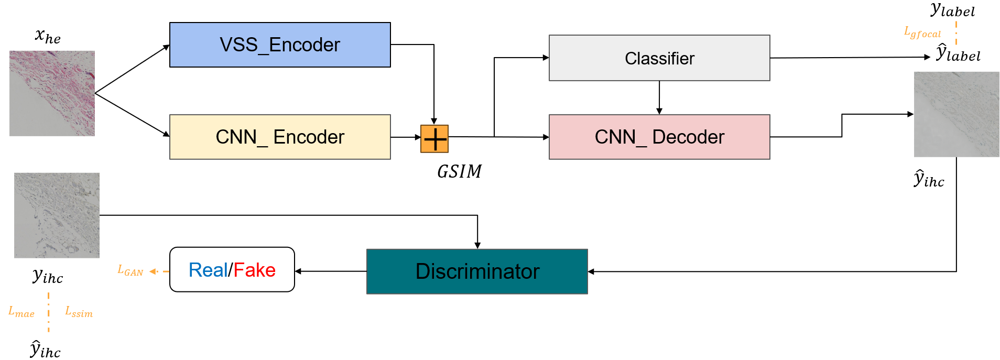

# Dual-Encoder with Feature Fusion for IHC Synthesis from HE-Stained Sections(Dual-Encoder_GSIM_BCIStainer)
Our dual-encoder model integrates HER2 expression and multi-scale features through a novel feature fusion module to enhance translation accuracy. On the BCI test set, our method surpasses existing approaches.

<p align="center">
    <br>
    
    <br>
</p>

## 1.Environment
Dual-Encoder_GSIM_BCIStainer runs in the Python environment. Here's a recommendation for your project environment:
- Python 3.8
- Torch 2.0.0
- Torchvision 0.15.1
- CUDA 11.8
```bash
# using conda
conda create --name bci python=3.8
conda activate bci

# pytorch 1.13.0
pip install torch==2.0.0 torchvision==0.15.1 torchaudio==2.0.1 --extra-index-url https://download.pytorch.org/whl/cu118

# other packages
pip install -r requirements.txt
```

## 2.Dateset
Download dataset from [BCI page](https://bupt-ai-cz.github.io/BCI/) and put it in [data](./data) directory as folowing file structure:
```
./data
├── test
│   ├── HE
│   ├── IHC
│   └── README.txt
├── train
│   ├── HE
│   ├── IHC
│   └── README.txt
└── val
    ├── HE
    ├── IHC
    └── README.txt
```

## 3.Train
```bash
CUDA_VISIBLE_DEVICES=0          \
python train.py                 \
    --train_dir   ./data/train  \
    --val_dir     ./data/val    \
    --exp_root    ./experiments \
    --config_file ./configs/stainer_basic_cmp/exp100.yaml \
    --trainer     basic
```

Download pretrained model and put it into above directory:
- BaiduYun: [https://pan.baidu.com/s/1QxZ2zB0CHZKyttXqpS9iDw](https://pan.baidu.com/s/1ok9BmbfK_dj6jiTZnrDMbQ?pwd=ixbg)

## 4.Evaluate
```bash
CUDA_VISIBLE_DEVICES=0            \
python evaluate.py                \
    --data_dir    ./data/test     \
    --exp_root    ./experiments   \
    --output_root ./evaluations   \
    --config_file ./configs/stainer_basic_cmp/exp100.yaml \
    --model_name  model_best_psnr \
    --apply_tta   true            \
    --evaluator   basic
```


## Acknowledgement
Many thanks for these repos for their great contribution!

[https://github.com/quqixun/BCIStainer/tree/main](https://github.com/quqixun/BCIStainer/tree/main)

[https://github.com/JCruan519/VM-UNet](https://github.com/JCruan519/VM-UNet)
